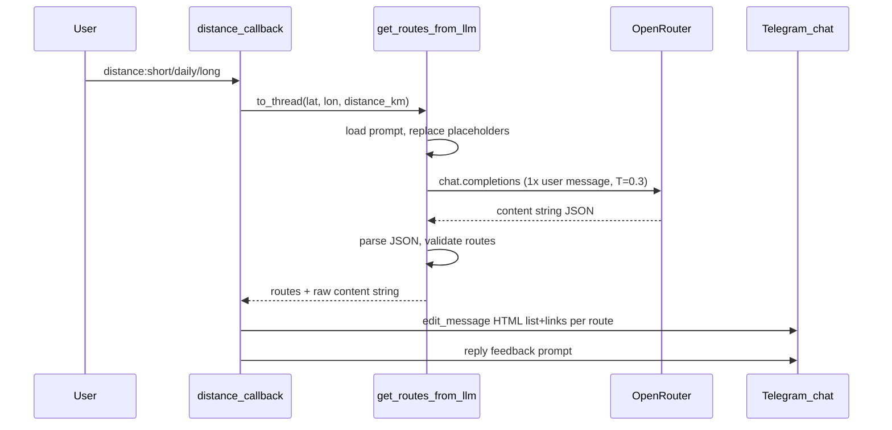

# Последовательность: вызов LLM и маршрут в Яндекс.Картах

Документ описывает **текущую** реализацию (код в `src/services/llm_route_service.py`, `src/handlers/search.py`, `src/utils/map_links.py`, промпт в `config/prompts/route_search.txt`).

---

## 1. Когда вызывается LLM

| Условие | Детали |
|--------|--------|
| Триггер | Пользователь на шаге выбора дистанции нажал одну из inline-кнопок с `callback_data` вида `distance:short`, `distance:daily`, `distance:long`. |
| Обработчик | `distance_callback` в [`src/handlers/search.py`](../../src/handlers/search.py). |
| Сколько раз за один «поиск» | **Ровно один** HTTP-запрос к OpenRouter на **одно** нажатие дистанции (при успешном прохождении проверок и наличии `OPENROUTER_API_KEY`). |
| Повторные вызовы | Новый вызов возможен только при новом проходе сценария («Найти маршрут» → точка → снова дистанция). |

Перед вызовом LLM в `user_data` уже лежат `search_start_lat` и `search_start_lon` (из геолокации, ручных координат или геокодирования адреса). Если координат нет, LLM не вызывается — показывается сообщение об истёкшей сессии.

Вызов выполняется в **`asyncio.to_thread(get_routes_from_llm, ...)`**, чтобы синхронный клиент OpenAI не блокировал event loop python-telegram-bot.

---

## 2. Параметры, передаваемые в LLM

Функция [`get_routes_from_llm(lat, lon, distance_km, ...)`](../../src/services/llm_route_service.py) получает:

| Параметр | Источник | Смысл |
|----------|----------|--------|
| `lat` | `context.user_data["search_start_lat"]` | Широта старта (WGS84). |
| `lon` | `context.user_data["search_start_lon"]` | Долгота старта (WGS84). |
| `distance_km` | Значение из выбранной кнопки дистанции | Число в километрах; в коде задано жёстко для трёх вариантов: **4**, **10**, **19** км (ключи `short` / `daily` / `long` в `DISTANCE_OPTIONS` в `search.py`). |

Дополнительно из окружения / `Settings` (не «в текст пользователя», а в конфиг API):

- `OPENROUTER_API_KEY` — обязателен; иначе `LLMRouteServiceError` без сетевого вызова.
- `OPENROUTER_MODEL` — имя модели на OpenRouter (по умолчанию `openai/gpt-4o-mini`).
- `OPENROUTER_BASE_URL` — по умолчанию `https://openrouter.ai/api/v1`.
- `OPENROUTER_APP_TITLE`, опционально `OPENROUTER_HTTP_REFERER` — заголовки для OpenRouter.
- `ROUTE_PROMPT_PATH` — путь к файлу промпта; по умолчанию `config/prompts/route_search.txt` относительно корня проекта.

---

## 3. Промпт: откуда берётся и что подставляется

1. Текст загружается из файла (`_load_prompt`), путь — `Settings.route_prompt_path`.
2. В тексте выполняется **строковая подстановка**:
   - `{{lat}}` → `str(lat)`
   - `{{lon}}` → `str(lon)`
   - `{{distance_km}}` → `str(distance_km)`
3. Итог — **одно** сообщение роли `user` в Chat Completions (см. ниже).

Содержимое шаблона по умолчанию — в [`config/prompts/route_search.txt`](../../config/prompts/route_search.txt): задаётся контекст (бег, стартовая точка, желаемая дистанция), требование **3–5** вариантов маршрутов, формат ответа **строго JSON** с массивом `routes`, для каждого элемента — `name`, `description`, `coordinates` (массив точек `[широта, долгота]`, 5–25 точек на маршрут).

Изменить поведение модели без смены кода можно правкой этого файла или указанием другого пути через `ROUTE_PROMPT_PATH`.

---

## 4. Запрос к API (OpenRouter)

В [`get_routes_from_llm`](../../src/services/llm_route_service.py) используется официальный клиент `openai` с `base_url` OpenRouter:

- Метод: **`chat.completions.create`**
- Параметры запроса:
  - `model` — из настроек (`OPENROUTER_MODEL`).
  - `messages=[{"role": "user", "content": prompt_text}]` — **один** user-текст (полный промпт после подстановок).
  - `temperature=0.3` — зафиксировано в коде.

Других сообщений (system, few-shot) в запросе **нет**.

---

## 5. Вид ответа модели и разбор

1. Берётся `response.choices[0].message.content` (строка).
2. Из строки извлекается JSON: сначала пробуется разбор целиком; при необходимости вырезается блок из markdown `` ```json ... ``` ``, либо подстрока между первой `{` и последней `}` — см. `_extract_json_from_response`.
3. Ожидается объект с ключом **`routes`** — **массив** объектов маршрутов.
4. Для каждого элемента массива:
   - обязательны поля **`name`**, **`description`**, **`coordinates`**;
   - `coordinates` — список минимум из **двух** точек; каждая точка — `[lat, lon]` в допустимых диапазонах.

После успешной валидации (`_validate_route`) данные нормализуются в список словарей Python:

```text
{"name": str, "description": str, "coordinates": [[lat, lon], ...]}
```

Пустые `name`/`description` после `strip` заменяются на значения по умолчанию (`"Маршрут N"`, `"—"`).

Если JSON невалиден, нет ключа `routes`, маршрут не проходит валидацию — выбрасывается **`LLMRouteServiceError`** с текстом для пользователя (без утечки внутренних деталей).

**Важно:** описание маршрута для пользователя целиком приходит **из поля `description` ответа LLM**; отдельного геокодирования или построения трека на стороне сервера нет — только то, что модель сгенерировала в JSON.

---

## 6. Как описание, ссылки и названия попадают в чат Telegram

Функция **`_format_llm_routes_message`** формирует:

- Текст в **HTML** (`parse_mode="HTML"`): заголовок сценария, затем для каждого маршрута блок  
  **`<b>N. {name}</b>`**, описание (`html.escape`), строка-гиперссылка **«Открыть в Яндекс.Картах»** с `href` из [`build_yandex_route_link(route["coordinates"])`](../../src/utils/map_links.py).
- Inline-клавиатуру под этим сообщением **нет** (пустая разметка).

Если массив маршрутов **пустой**, показывается запасной текст «Маршруты не найдены…».

После успешного ответа LLM (в т.ч. с пустым массивом) отправляется отдельное сообщение с опросом «Как вам подбор маршрутов?» и callback `feedback:*`; в БД пишется с фиксированным `route_name` «Подбор маршрутов».

---

## 7. Как строится ссылка на Яндекс.Карты

Для каждого маршрута в том же сообщении, что и список, вызывается [`build_yandex_route_link(coordinates)`](../../src/utils/map_links.py).

Логика ссылки:

- Формат URL: `https://yandex.ru/maps/?rtext=...`
- Параметр **`rtext`**: точки соединяются через **`~`**, каждая точка — **`широта,долгота`** (как в промпте: порядок `[lat, lon]`).
- Если точек больше **25**, выполняется **прореживание** (равномерный выбор индексов), чтобы не раздувать URL.
- Строка передаётся через `urllib.parse.quote` с `safe=',~'`.

Яндекс.Карты по этому URL строят маршрут по переданной полилинии точек; приложение **не** вызывает отдельный Routing API — используются только координаты из ответа LLM.

---

## 8. Схема последовательности (кратко)



---

## 9. Логирование в `ANALYTICS_CHAT_ID`

При заданной переменной окружения `ANALYTICS_CHAT_ID` после успешного ответа LLM отправляются **два** сообщения в служебный чат (формат **HTML**, `parse_mode=HTML`: пиктограммы, заголовки `<b>`, разделители, `<code>` для id, `<pre>` для сырого JSON):

1. **`log_job_completed`** — сводка: пользователь, стартовая точка, нумерованный список маршрутов, длительность сессии.
2. **`log_llm_response`** — в одном сообщении: **текст запроса** к API (промпт после подстановки `{{lat}}`, `{{lon}}`, `{{distance_km}}`), имя **модели** (`OPENROUTER_MODEL`) и **полный** `message.content` ответа (до разбора JSON). Оба длинных блока в `<pre>`, при необходимости обрезаются с пометкой «обрезано». Экранирование через `html.escape`.

Код: [`src/services/analytics_telegram.py`](../../src/services/analytics_telegram.py), вызов из [`distance_callback`](../../src/handlers/search.py).

---

## 10. Связанные переменные окружения (шпаргалка)

| Переменная | Роль для LLM |
|------------|----------------|
| `OPENROUTER_API_KEY` | Доступ к OpenRouter (обязательно для вызова). |
| `OPENROUTER_MODEL` | Модель чата. |
| `OPENROUTER_BASE_URL` | Базовый URL API (по умолчанию OpenRouter). |
| `OPENROUTER_APP_TITLE`, `OPENROUTER_HTTP_REFERER` | Заголовки клиента. |
| `ROUTE_PROMPT_PATH` | Файл промпта с `{{lat}}`, `{{lon}}`, `{{distance_km}}`. |
| `ANALYTICS_CHAT_ID` | Опционально: чат для двух служебных логов (сводка JOB + сырой ответ LLM). |
